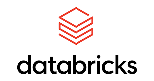

# DATA SCIENTIST                                
       

### ABOUT 
In the field of Data Science, I have gained significant experience over the past 4+  years. Throughout my career, I have developed a passion for utilizing Python, PySpark, Machine Learning, Deep Learning, Cloud Computing, and Data Engineering to deliver successful projects for my clients. I hold an M.Sc. in Mathematics and Computer Science from Jamia University, Delhi.

Over the course of my career, I have had the opportunity to collaborate with various clients across multiple industries. I am particularly proud of my work on the Databricks Platform, where I have completed successful projects for numerous clients. Additionally, I have achieved certifications as an AWS Solution Architect and Developer Associate, allowing me to expand my expertise and bring greater value to my clients.
As a Data Scientist, my objective is to utilize my skills and knowledge to have a positive impact on the world of technology. I firmly believe in utilizing data to make well-informed decisions, optimize processes, and promote innovation. I am enthusiastic about keeping up with the latest developments and trends in the field and welcome opportunities to further my knowledge and skills.

### EXPERIENCE SUMMARY:
- Data Scientist with 4+ years of experience.
- Proficiency in Python, PySpark, SQL, Databricks, and MLflow.
- Expertise in Machine Learning, Deep Learning, GenAi, RAG, LLM, Langchain, MLOps, Computer Vision, Time Series Forecasting, Large Language Models, and Generative AI.
- Experience in working with Spark ML models.
- Demonstrated skill in solving complex business problems using data-driven methods.

### SKILLS
- **Technologies & Tools**: Python, PySpark, SQL, Shell Scripting, Databricks, Spark ML, MLflow, AWS
- **Machine/Deep Learning**: Regression Models, Classification Models, Neural Networks, Convolutional Neural Networks, Recurrent Neural Networks, Natural Language Processing, Propensity 
Modeling, Hypothesis Testing, Time Series Modeling, MLOps
- **Generative AI**: Prompt Engineering, LLM Fine-Tuning, LLM-Quantization, LLM Serving on MLflow, LLM CPU Inference, LangChains and Agents

### FRAMEWORK
               

### EDUCATION

- **MSc Mathematics and Computer Science** from Jamia Millia Islamia 
- **Bsc Mathematics (Hons)** from Delhi University

### WORK EXPERIENCE
- **Oct 2021 - Till Date**- Data Scientist (Koantek)
- **July 2019 - Sep 2021**- Data Scientist (TCS)
- **Jan 2019 - March 2019**- Data Analyst (TCS)

### PROJECTS

- **Incremental Return on AdSpend**
  - **Development Tools**: K-means Clustering, Statistical Analysis Tools
  - **Project Description**: Developed analytical solutions for Swiftly Systems to improve incremental returns on ad spending.
    - **Responsibilities**:
      - Conducted two-tailed and right-tailed statistical tests for data analysis.
      - Developed a K-means clustering model for user segmentation in a dataset of over 500K users.
      - Created and documented a pipeline for campaign lift analysis across 250+ campaigns.

- **Propensity and Sentiment Modeling**
  - **Development Tools**: Machine Learning Models, XLNet, ALBERT, RoBERTa, DistilBERT
  - **Project Description**: Develop models for customer conversion and audience sentiment analysis.
    - **Responsibilities**:
      - Cleaned and transformed aggregated datasets for feature derivation.
      - Developed propensity models and sentiment analysis using state-of-the-art techniques.
      - Automated the process of creating lookalike audiences and sentiment analysis for clients.

- **Heimdall Correlation**
  - **Development Tools**: Data Analysis and Visualization Tools
  - **Project Description**: Analyzed digital marketing data for Fluid to identify correlations and patterns.
    - **Responsibilities**:
      - Performed Exploratory Data Analysis and Hypothesis Testing.
      - Developed a Databricks pipeline for finding similarities in Google searches across different US states.

- **Forecasting**
  - **Development Tools**: Forecasting Models
  - **Project Description**: Created forecasting models to predict device usage and internet data needs in Japan.
    - **Responsibilities**:
      - Forecasted daily maximum concurrently active devices for the next fifteen days.
      - Predicted daily internet data usage for efficient planning and resource allocation.

- **LLM Chatbot**
  - **Development Tools**: Large Language Models, Streamlit, OpenAI API, Zendesk Chat
  - **Project Description**: Developed an advanced chatbot for enhancing customer support.
    - **Responsibilities**:
      - Integrated a Large Language Model with Zendesk Chat for improved customer engagement.
      - Developed a Knowledge Manager application for dataset management and enrichment.
      - Enhanced bot engagement and resolution rates through Vector Search Database and ChatGPT customization.

- **Demand Forecasting**
  - **Development Tools**: Asset Bundle, Forecasting Models
  - **Project Description**: Migrated 700+ models for store location forecasting, aggregated on a date basis, and parallelized the model training process. Created a serving pipeline for deployment across all three environments using a deployable Asset Bundle.
    - **Responsibilities**:
      - Forecasted product store series with 700+ models for 30 days of forecast.
      - Predicted demand for each product across multiple sources.
      - Created a deployable Asset Bundle pipeline to train, test, and deploy models in different Databricks environments, including production, UAT, and development.

- **Safety Literature Review (SLR)**
  - **Development Tools**: NLP Tools, EDA Techniques
  - **Project Description**: Assisted regulatory requirements through an SLR tool.
    - **Responsibilities**:
      - Conducted Exploratory Data Analysis and Hypothesis Testing for clinical trial criteria.

- **Competitive Intelligence Platform (CIP)**
  - **Development Tools**: Market Analysis Tools
  - **Project Description**: Developed a tool to gather and analyze market and competitor information.
    - **Responsibilities**:
      - Enhanced competitive advantage through detailed market analysis.

- **Medical Literature Review (MLR)**
  - **Development Tools**: Content Review and Compliance Tools
  - **Project Description**: Created a tool to ensure compliance in medical literature and marketing materials.
    - **Responsibilities**:
      - Ensured adherence to guidelines in various marketing assets including PDFs, images, and documents.

- **ADVISORY/POCs**
  - **Project 1: Anomaly Detection on Orders Data**
    - **Development Tools**: LSTM Autoencoder, Isolation Forest, SHAPLEY Values
    - **Project Description**: Implemented anomaly detection for Casella Waste Systems using advanced machine learning techniques.
      - **Responsibilities**:
        - Tested LSTM Autoencoder with 50K parameters and Isolation Forest for unsupervised anomaly detection.
        - Implemented SHAPLEY values over the Isolation Forest model to understand feature importances and model inference.

  - **Project 2: MLflow Best Practices Advisory**
    - **Development Tools**: MLflow, Databricks
    - **Project Description**: Advised Altria Labs on best practices in model building, deploying, and monitoring in the Databricks ecosystem.
      - **Responsibilities**:
        - Researched best practices for model lifecycle management.
        - Demonstrated MLflow capabilities including Tracking, Model Registry, and Model Serving using a Data Science use case.

### KEY ACHIEVEMENTS & RESEARCH PUBLICATION
[Publication](https://www.mdpi.com/2079-9292/11/20/3336)
- **“Drug Adverse Event Detection Using Text-Based Convolutional Neural Networks (TextCNN) Technique”** The present study is a part of the project which aims to design an intelligent medical information retrieval and summarization system.In my recent paper, my results outperforms the  result of existing research paper on classification task with the increase in precision and recall of 2.1 

